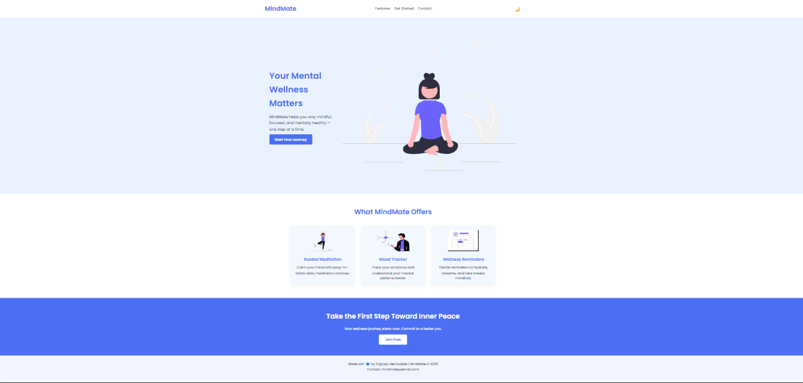
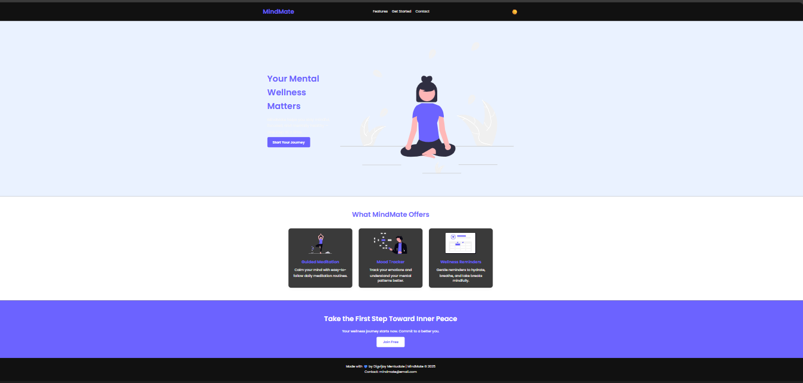

# CODSOFT
# 🧠 MindMate – Your Mental Wellness Companion

A beautifully designed and responsive **landing page** project developed during my Web Development Internship at **CodSoft**.

---

## 🔍 Project Overview

**MindMate** is a wellness-themed landing page that promotes mental health awareness and mindfulness practices. It's built with clean HTML, CSS, and JavaScript, focused on interactivity, accessibility, and mobile responsiveness.

---

## 🚀 Features

- 💬 Clean and modern UI design
- 🧘‍♀️ Sections for features like Guided Meditation, Mood Tracking, and Wellness Reminders
- 🎯 Smooth scrolling and responsive layout
- 📱 Mobile-friendly design
- ✨ Call to Action & Contact section

---

## 🛠️ Tech Stack

- HTML5
- CSS3 (Flexbox & Grid)
- JavaScript (for interactivity)
- Google Fonts

---

## 📸 Screenshots

### 🟦 Landing Page Preview

## 🔗 Live Demo

> _Coming soon_ (Optional: Add Netlify or GitHub Pages link after deployment)

---

## 📁 Folder Structure
MindMate-LandingPage/
│
├── index.html # Main HTML file
├── style.css # Custom styles
├── script.js # Smooth scroll functionality
├── README.md # Project overview and documentation
├── assets/
│ ├── images/
│ │ ├── hero-mindmate.svg
│ │ ├── meditation.svg
│ │ ├── mood-tracker.svg
│ │ └── reminder.svg
│ └── screenshots/
│ ├── screenshot1.png
│ ├── screenshot2.png

